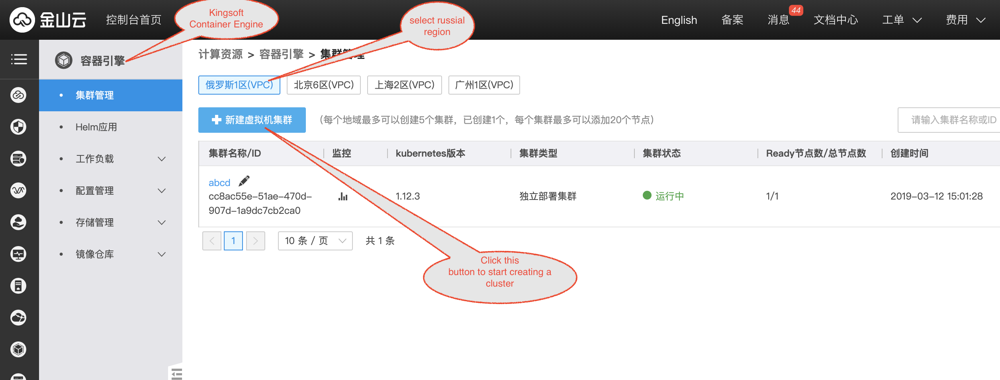

### How To Reproduce:


#### Login
Login to [Kingsoft Cloud](https://passport.ksyun.com/) Website with your own kingsoft cloud account. If you don't have an account,please refer to the [page](https://passport.ksyun.com/register.html) to sign up an account first.

#### Create Kubernetes Cluster
Go to [Kingsoft Container Engine](https://kce.console.ksyun.com/)，please refer to the [documentation](https://docs.ksyun.com/documents/2664) for more information about how to create a cluster. 

**Note:**
- The cluster region need choose out of China( e.g. Russia1)
- The cluster Kubernetes version need choose 1.15.5.



#### Access to Cluster
Once you Kubernetes cluster is active, Download it's kubeconfig file on the cluster details page and save it locally.


#### Run Conformance Test
1. Download a sonobuoy [binary release](https://github.com/heptio/sonobuoy/releases) of the CLI, or build it yourself by running:
    ```sh
    $ go get -u -v github.com/heptio/sonobuoy
    ```

1. Configure your kubeconfig file by running:
    ```sh
    $ export KUBECONFIG="/path/to/your/cluster/config"
    ```

3. Run sonobuoy:
    ```sh
    $ sonobuoy run
    ```

4. Watch the logs:
    ```sh
    $ sonobuoy logs
    ```

5. Check the status:
    ```sh
    $ sonobuoy status
    ```

6. Once the status commands shows the run as completed, you can download the results tar.gz file:
    ```sh
    $ sonobuoy retrieve
    ```